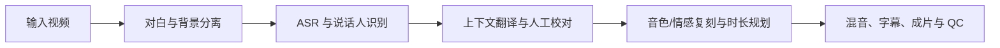

<div align="center">

# IndexTTS-DubFlow

**基于 IndexTTS 2.5 的原声视频翻译与智能配音工作流**

从对白分离、语音识别和上下文翻译，到人物音色/情感复刻、时间轴对齐与成片输出。

<!--
外部图片始终使用可信的 HTTPS 原始地址。GitHub 渲染 README 时会自动通过
GitHub Camo 代理、缓存并匿名化这些图片；不要把渲染后的 camo.githubusercontent.com
哈希地址复制回源码，否则上游图片更新或仓库迁移时容易失效。
-->

[](https://colab.research.google.com/github/jasonBrom/IndexTTS-DubFlow/blob/main/notebooks/IndexTTS_DubFlow_Colab_R8.ipynb)
[](https://github.com/jasonBrom/IndexTTS-DubFlow/actions/workflows/ci.yml)
[](https://github.com/jasonBrom/IndexTTS-DubFlow/releases)
[](https://www.python.org/)
[](LICENSE)

[English](README_EN.md) · [安装说明](docs/INSTALLATION.md) · [配置说明](docs/CONFIGURATION.md) · [架构](docs/ARCHITECTURE.md) · [故障排查](docs/TROUBLESHOOTING.md)

</div>

> [!IMPORTANT]
> 本项目不是 IndexTTS 官方项目。使用视频、人物声音、字幕、翻译及生成结果前，请确认已获得相应授权。禁止用于欺诈、冒充、侵权或其他违法用途。

## 项目简介

IndexTTS-DubFlow 是一套端到端视频译制流水线。它从视频中分离对白与背景，识别并翻译对白，再按人物复刻原音色和情感；时间规划以自然语速为优先，在不推迟句首、不侵占下一句对白的前提下利用真实静音，最终输出译制视频、独立音轨、字幕、可编辑时间轴和质量报告。

新增 **Index-Translate 官方公网 API / 自建服务、Index-Homura 音节控制**，保留 IndexTTS 2.5 配音。打开高级设置即可选择。部署与研究结论见 [Index 翻译接入说明](docs/INDEX_TRANSLATE.md)。

当前版本：`v0.3.0 / R8`

固定上游 IndexTTS 2.5 提交：`ccd81054de9859faeb19b773fff0e2e1ae9e959e`



## 核心能力

- Gradio Web 面板，支持浏览器上传、本地路径和 Google Drive。
- Demucs 对白/背景分离；AST 唱歌检测默认保护歌曲、合唱和非对白人声。
- Faster-Whisper、FireRedASR2/2S、Qwen3-ASR-1.7B + ForcedAligner、Fun-ASR-Nano。
- 文本/文件热词库，以及 `错词=>正确词` 的确定性纠错。
- HY-MT2-7B/1.8B、NLLB、Chat Completions 兼容 API 和人工译文。
- JSON、SRT、VTT、ASS、SSA 时间轴导入/导出；人工译文可锁定，续跑时不会被覆盖。
- 逐人物音色参考、逐句原片情感参考与 QwenEmotion 文本情感控制。
- 自然语速优先，仅借用下一句前的真实静音；无法容纳时再启用温和时长控制。
- 断点续跑、逐句 TTS 缓存、独立音轨、字幕、成片和 `qc_report.json`。
- 单一 Hugging Face 缓存、禁用 Xet 重建副本、HY-MT2 下载前空间预检。

## 一键在 Colab 运行

推荐首次使用直接打开完整可见日志版：

[](https://colab.research.google.com/github/jasonBrom/IndexTTS-DubFlow/blob/main/notebooks/IndexTTS_DubFlow_Colab_R8.ipynb)

- [完整可见日志版 Notebook](notebooks/IndexTTS_DubFlow_Colab_R8.ipynb)
- [精简版 Notebook](notebooks/IndexTTS_DubFlow_Colab_R8_Compact.ipynb)

Notebook 内嵌与当前版本一致的项目源码，不依赖运行时再次克隆本仓库。推荐使用 L4、A10 或 A100；T4 不支持 BF16，会自动回退到 FP32，速度更慢且更容易出现显存压力。

## 平台支持

| 平台 | 支持状态 | 说明 |
| --- | --- | --- |
| Linux x86_64 + NVIDIA | 完整支持 | 推荐 Ubuntu 22.04/24.04、CUDA 12.8+、Python 3.11 |
| Windows 10/11 + NVIDIA | 完整支持 | 提供原生 PowerShell 安装；复杂依赖场景推荐 WSL2 |
| Windows WSL2 + NVIDIA | 完整支持（推荐） | 使用 Linux 命令，GPU 由 Windows NVIDIA 驱动透传 |
| Docker + NVIDIA Toolkit | 完整支持 | 适用于 Linux 或 Windows WSL2 Docker，运行时与输出可持久化 |
| Google Colab | 完整支持 | 推荐 L4/A10/A100；T4 可运行但速度和显存余量较差 |
| macOS Intel/Apple Silicon | 有限支持 | 可运行 Web、测试及部分 CPU 阶段；完整 TTS 受上游 CUDA 能力限制 |
| AMD/Intel GPU | 未保证 | 当前完整链路以 CUDA 为主，回退 CPU 后不适合长视频正式出片 |

完整限制和验证范围见[安装与平台矩阵](docs/INSTALLATION.md)。

## 硬件与磁盘

- 推荐 GPU：L4、A10、A100、RTX 3090/4090 或更新型号。
- T4 16 GB：可以运行，但 Qwen3-ASR 与 HY-MT2 建议分阶段串行。
- 显存低于 10 GB：不建议执行完整视频译制。
- 基础环境、IndexTTS 主模型和辅助模型建议至少预留 25 GB。
- Qwen3-ASR-1.7B + ForcedAligner 会额外占用磁盘。
- HY-MT2-7B 原始权重约 16.1 GB；4-bit 只减少加载显存，不减少下载体积。磁盘紧张时选择 1.8B，或把 `HYMT_HF_HOME` 指向其他磁盘。

## 本地快速开始

### Linux / WSL2

先安装 Python 3.11、Git、FFmpeg 和可用的 NVIDIA 驱动：

```bash
git clone https://github.com/jasonBrom/IndexTTS-DubFlow.git
cd IndexTTS-DubFlow
chmod +x scripts/*.sh
./scripts/bootstrap.sh --model-source modelscope
./scripts/run.sh --server-name 127.0.0.1 --server-port 7860
```

### Windows PowerShell

安装 Python 3.11 x64、Git、FFmpeg 和 NVIDIA CUDA 12.8+，重开 PowerShell：

```powershell
git clone https://github.com/jasonBrom/IndexTTS-DubFlow.git
Set-Location IndexTTS-DubFlow
Set-ExecutionPolicy -Scope Process Bypass
.\scripts\bootstrap.ps1 --model-source modelscope
.\scripts\run.ps1 --server-name 127.0.0.1 --server-port 7860
```

默认情况下，源码、虚拟环境、模型和按需建立的 ASR/翻译环境位于仓库的 `.runtime`。该目录已加入 Git 忽略规则。也可把运行环境放到其他大容量磁盘：

```powershell
.\scripts\bootstrap.ps1 --runtime-root D:\IndexTTS-DubFlow-Runtime
$env:DUBBER_RUNTIME_ROOT = "D:\IndexTTS-DubFlow-Runtime"
.\scripts\run.ps1
```

### Docker

安装 Docker、Compose 与 NVIDIA Container Toolkit 后运行：

```bash
GRADIO_AUTH='user:strong-password' docker compose up --build
```

首次启动会在持久卷中安装环境和模型，输出写入 `./outputs`。也可先单独安装：

```bash
docker compose run --rm dubber setup --model-source huggingface
docker compose up
```

## 启动与访问

```text
--server-name 127.0.0.1   仅本机访问（推荐默认值）
--server-port 7860        Web 端口
--auth user:password      登录保护
--share                   创建临时 Gradio 公网链接
```

监听局域网或公网地址时必须设置强密码：

```bash
GRADIO_AUTH='user:strong-password' ./scripts/run.sh --server-name 0.0.0.0
```

## 输出文件

每个任务使用独立目录，主要包含：

| 文件/目录 | 用途 |
| --- | --- |
| `timeline.json` | 可续跑、可人工编辑的完整时间轴 |
| `*.srt` / `*.vtt` / `*.ass` | 原文、译文或双语字幕 |
| `tts_segments/` | 逐句 TTS 缓存，可从中断点继续 |
| `dubbed_audio.*` | 独立译制音轨 |
| `dubbed_video.*` | 最终译制视频 |
| `qc_report.json` | 时长、压缩、失败与人工复核提示 |

完整数据流见[架构说明](docs/ARCHITECTURE.md)，全部选项见[配置说明](docs/CONFIGURATION.md)。

## 项目结构

```text
.
├── app.py                         # Web 启动入口
├── original_dubber/               # 译制流水线
├── notebooks/                     # 可直接从 GitHub 打开的 Colab Notebook
├── patches/                       # 固定上游提交的时长补丁
├── scripts/                       # 安装、启动、诊断与打包
├── tests/                         # 不下载大模型的核心测试
├── docs/                          # 安装、配置、架构和排障文档
├── .github/                       # CI、Release、Issue 与 PR 模板
└── .runtime/                      # 本地环境和模型，不提交到 Git
```

## 开发与验证

```bash
python -m pip install -e '.[test]'
python -m compileall -q app.py original_dubber scripts tests
pytest -q
ruff check .
python scripts/setup_runtime.py --dry-run
python scripts/build_artifacts.py
python scripts/build_artifacts.py --check
```

轻量测试不会下载模型。完整 GPU smoke test 需要已安装的 IndexTTS 2.5 权重与 NVIDIA CUDA 环境。

## 发布

仓库已包含三平台 CI、标签发布工作流、Issue/PR 模板、安全策略和可复现交付件生成器。完整步骤见 [GitHub 发布清单](docs/GITHUB_RELEASE.md)。推送 `v0.3.0` 标签后，Actions 会创建 Release 并上传源码包、两种 Colab Notebook 与 SHA256 校验文件。

## 已知边界

- 对齐目标是每句占用的总时间窗，不是逐音素嘴型同步。
- 对白与歌曲人声完全重叠时，通用两路分轨无法无损移除对白。
- 多人重叠说话、AST 唱歌误判及极端语言长度差需要人工复核。
- 自动识别、翻译和声音克隆均可能产生错误或不自然结果。
- 模型站、CUDA、显卡驱动及第三方模型许可证由各自上游决定。

## 许可证与致谢

本仓库原创编排代码使用 [MIT License](LICENSE)。IndexTTS 代码、模型权重、输出及衍生使用受上游 **bilibili Model Use License Agreement** 和免责声明约束；ASR、翻译、Demucs、Pyannote、AST 等组件保留各自许可证。详见 [THIRD_PARTY_NOTICES.md](THIRD_PARTY_NOTICES.md)。

感谢 [IndexTTS](https://github.com/index-tts/index-tts) 及所有相关开源项目的贡献者。
