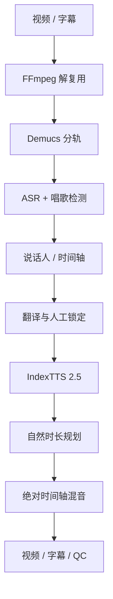

# 架构与数据流



## 阶段隔离

分轨、ASR、翻译、TTS 依次运行，阶段结束主动释放 GPU。Qwen3-ASR、FireRedASR2、Fun-ASR-Nano 和 HY-MT2 使用独立虚拟环境，避免它们要求的 Transformers 版本污染 IndexTTS 主环境。

虚拟环境路径通过平台函数解析：POSIX 为 `.venv/bin/python`，Windows 为 `.venv/Scripts/python.exe`。

## 时长策略

1. 先按自然语速生成；
2. 句首保持原时间；
3. 只借用到下一句之前的真实静音；
4. 若仍放不下，调用目标 Mel 帧补丁；
5. 最终按采样点裁剪/补零，保证总时间窗精确。

这不等同于逐音素唇形同步。极端语言长度差应优先人工缩写或扩写译文。

## 输出目录

```text
任务目录/
├── manifest.json
├── input/source.*
├── audio/original.wav
├── audio/dialogue_16k.wav
├── stems/
├── speakers/
├── emotion_refs/
├── timeline.json
├── tts/segment_*.wav
├── subtitles/
├── mix/
├── output/*_ZH.mp4
└── qc_report.json
```

## 上游固定与配置修复

安装器固定 IndexTTS 官方提交 `ccd81054...`，避免移动分支改变补丁上下文。模型 Hub 的 `config.yaml` 会先验证 2.5 专属结构，再修正错误的 `version: 2.0` 和 `/cubefs/...` 内部路径；真正的 2.0 配置不会被重新标记。

